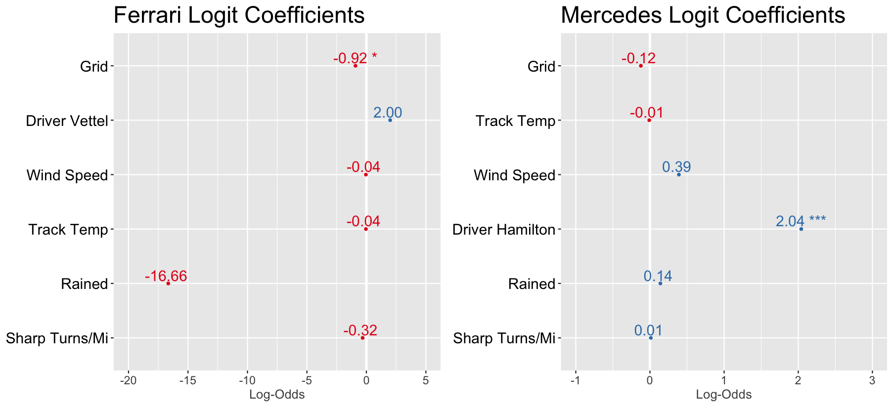
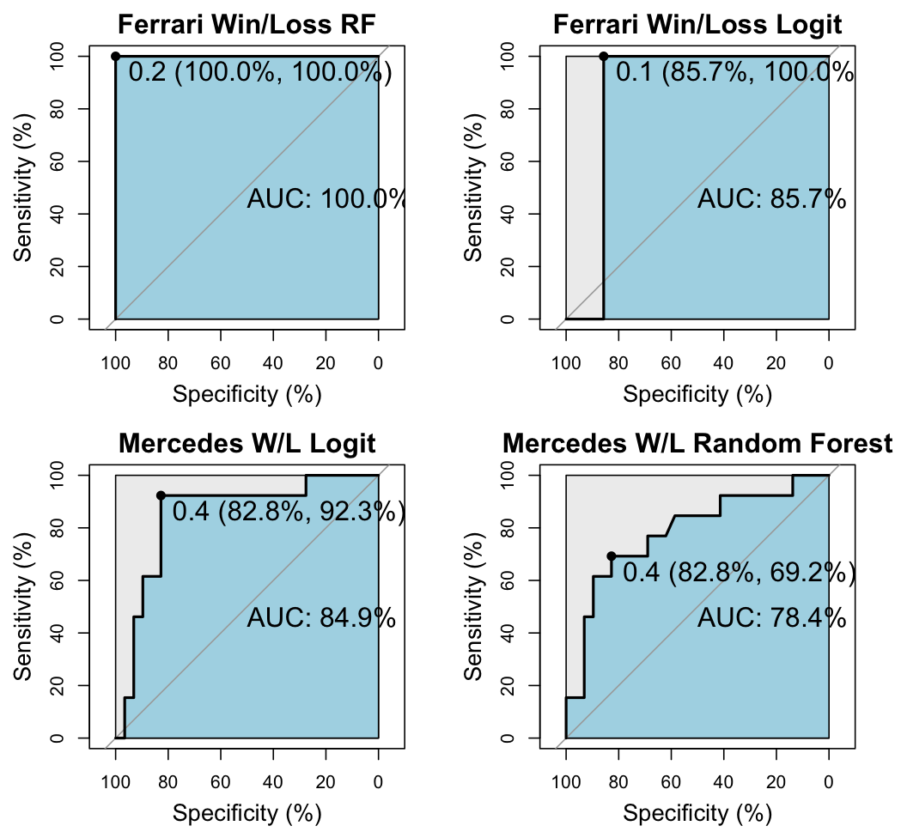
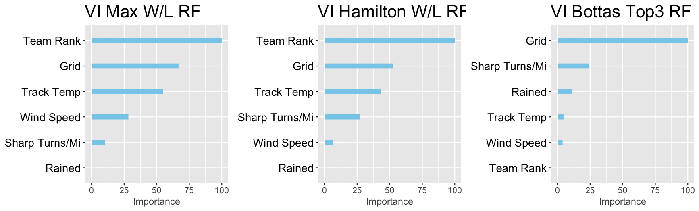
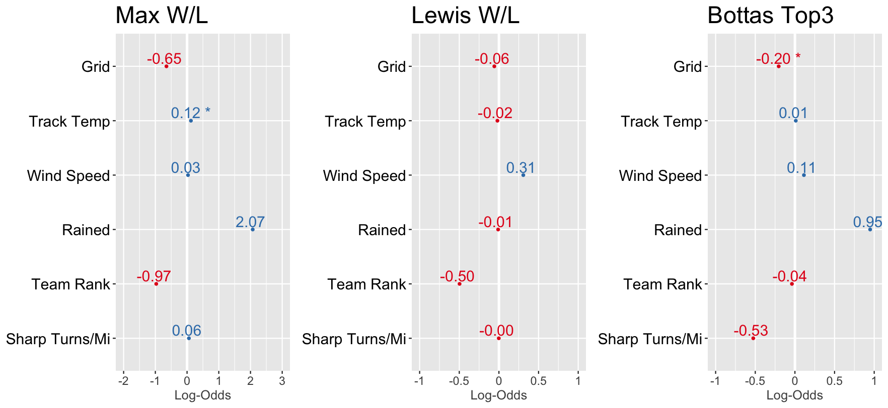
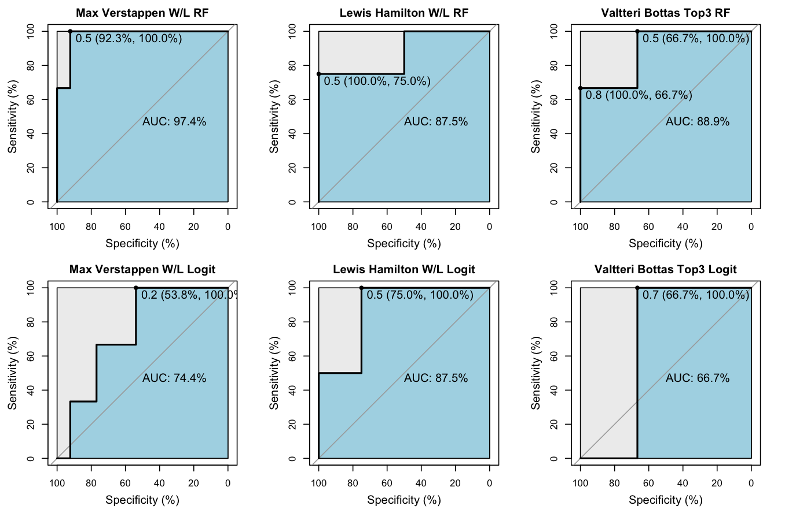

# Background and Purpose

Formula 1 also known as F1 is a series of races (Grand Prix) is a
globally recognized sport and is one of the fastest growing sports in
the United States. The sport has been around since the early 1950s and
is considered as the pinnacle of motorsport. To be the F1 world champion
is synonymous with being the absolute best. Each year a driver and a
team (also known as constructor) is awarded a championship based on the
points won each season.

Unlike other major sports in the United States such as the NBA where
sixty rookies enter the league each year; opportunities in F1 are rare.
There are a total of 20 "seats" across all of Formula 1 and in 2022,
only one rookie was given a Formula 1 seat. The average career in
Formula 1 is about 8 seasons. With such small opportunities and sample
sizes, teams are left with the hard choice of either locking up a former
world champion for a high amount or risk giving a chance to a newbie or
average driver for 3-4 years on a contract.

There is a common saying that there is F1 and then there is F1.5. This
is referring to the large gap in performance between the top two or
three teams in a given season and the rest of the field. This
discrepancy is due to the difference in budgets between the top teams
(approximately \$485 million per year) and the back marker teams (\$145
million per year). As small teams have to rely heavily on sponsors to
continue with the added pressure of performing to appease the said
sponsors.

The purpose of this project is to use classification models to
understand the effect of which factors are the most important for
top-tier, mid-pack (best of the rest), and low-tier (AKA backmarkers)
and what would be an ideal strategy for each team aiming to move from
each tier. Also to answer the question of how well does each driver rank
within their team as a way of comparing individual driver ability.

# The Data

The data used for this project was a mixture of a public dataset from
Kaggle
(<https://www.kaggle.com/datasets/rohanrao/formula-1-world-championship-1950-2020>)
with further enrichment from a package FastF1
(<https://theoehrly.github.io/Fast-F1/>).

This data was broken down into multiple sheets with cross referenced ids
and had data available for races from 1950 to 2020. The sheets are
broken down into mainly two types of data: reference data and result
data. Not all data was used to create the models and a summary of the
data used is listed below. Additionally, enhancements to some of the
data was used to further enrich additional variables for data modeling.

+----------------+----------------+-----------------------------+
| Dataset Name   | Description    | Additional Enhancements     |
+================+================+=============================+
| qualifying     | Summary of     | Track Temp, Air Temp, Wind  |
|                | qualifying     | Speed was added via python  |
|                | session for    | package FastF1              |
|                | each race.     |                             |
|                | Data included  |                             |
|                | all session    |                             |
|                | times          |                             |
+----------------+----------------+-----------------------------+
| results        | Summary of     | Air Temp, Track Temp, Wind  |
|                | race results   | Speed, Weather, Car         |
|                | per driver and | Performance Metric, Fastest |
|                | team           | Lap was found per driver,   |
|                |                | Turns, Sharp Turns,         |
+----------------+----------------+-----------------------------+

## Data Assumptions and Wrangling

The majority of the data provided and extracted are categorical
variables. The results of each race and amount of each race is a
discrete distribution. However, the variables within each category are
assumed to be normally distributed (average speed, lap times,
temperature of environment, etc.).

In the original dataset, there were 4 explanatory variables available to
model our classification models. (grid, circuit, driver, fastest_speed)
Our concern was the lack of additional variables given to us to produce
models with different combination of variables. Therefore, a large
effort was made to create additional variables such as Air.Temp,
Track.Temp, Wind.Speed, Weather, Race.Circuit type (street or racing
circuit), n_of_Sharp_Turns, car_performance, track_type based on speed,
and turns per mile. We normalized car performance data by using the
qualifying times of each team and comparing the difference in time of
each team against the fastest team of the qualifying session.

Lastly, due to the nature of the data there is some existence of
dependencies with certain variables such as car performance, driver
performance, and grid order. In our models we viewed each as a system of
variables that describes a certain feature. (i.e grid is the location of
the each racer relative to each other, car performance is the pure
performance of a car by averaging two drivers, and driver's racecraft
such as maneuvering, blocking, and/or ability to read situations). We
also assume that all environmental variables are equal for all drivers
during the time of the race and affect drivers equally. In reality, car
set-ups have some effects on these and will affect each car differently.

## Data Selection

Formula 1 as a sport has changed drastically over the years and is
broken down into separate eras of similar cars based on their
technology. We would like to compare as similar of cars as possible so
the era chosen was the most recent era called the "Turbo-Hybrid" era
which comes from the use of a hybrid engine along with turbos and
occurred between 2014 to 2021 which is the subset of our analysis.

Furthermore, most contracts for drivers range between 1-5 years and many
young drivers don't make it past 3-4 years in the sport. We decided to
take data from 2018 to 2021 to build our model and make an applicable
equivalency to a typical contract length and to keep similar drivers and
teams.

Additionally, we omitted races where a driver had to retire and was not
able to complete the race. In racing, these could be a result of a
collision, mechanical issue, or illness.

.jpeg){width="6in"}

Throughout the four years, there were 32 total drivers that participated
in at least 1 formula one race. There were many drivers that had less
than 40 races and many did not have race data in one of the four years.
We chose to go after the top 10 drivers with completed races in an
effort to limit the driver variables and to limit the amount of
incomplete data in the dataset. These drivers were Hamilton, Vettel,
Bottas, Perez, Sainz, Rakkonen, Gasly, Stroll, Leclerc, and Verstappen.

# Purpose 1

To understand the differences between top, mid-tier, and backmarkers, we
decided to run classification models for 3 different types of race
results. In our first analysis, we looked at classification models to
predict race wins.

### Race Wins:

{width="6in"}

To find the best classification model, we decided to run 3 different
types of models: logistic regression, random forest, and XgBoost. One
issue with classifying race wins is that the "Win" positive class is
extremely small when compared with the "Lose" category. In the 81 races,
there is a proportion of 5% (1 in 20 average) in the Win class and 95%
in the Lose class. Therefore, to evaluate our model we will be heavily
relying on the sensitivity accuracy.

We used ROC curves based on test data to give us an overview with
default parameters to find the optimal threshold for each model and
looked at the overall accuracy, specificity, and sensitivity (with "Win"
as the positive class) for all three models.

{width="7.4in"}

Overall, it appears that all models were comparable with the Boost model
having a slightly higher AUC. For our analysis, we are primarily
interested in the "Win" prediction and what factors are important to
achieve this result. Therefore, setting the threshold to 0.1 for both
Logistic and Forest models looked to give us the best overall score and
highest specificity score and setting the threshold value to 0.05
appeared to be the best threshold for the boost model.

With the following thresholds, we then ran the models with a 60/40 split
with cross validation of 5 folds and found the following accuracy,
specificity, and sensitivity on the test data.

+-------------+-------------+-------------+-------------+
| Model Type  | Accuracy    | Sensitivity | Specificity |
|             |             | (Win Class) | (Lose       |
|             | (95% CI)    |             | Class)      |
+=============+=============+=============+=============+
| Logistic    | 77.7%       | 91.6%       | 75.8%       |
| Regression  |             |             |             |
| (Threshold  | (72.6%,     |             |             |
| \> 0.1)     | 82.3%)      |             |             |
+-------------+-------------+-------------+-------------+
| Random      | 79.5%       | 86.1%       | 78.5%       |
| Forest      |             |             |             |
| (Threshold  | (74.4%,     |             |             |
| \>0.1)      | 83.9%)      |             |             |
+-------------+-------------+-------------+-------------+
| Extreme     | 75.1%       | 88.9%       | 73.2%       |
| Gradient    |             |             |             |
| Boost       | (69.8%,     |             |             |
| (Threshold  | 80.0%)      |             |             |
| \>0.05)     |             |             |             |
+-------------+-------------+-------------+-------------+

: Accuracy Scores for Classification Models (Race Wins)

Comparing across all 3 models, it appears that the Logistic Regression
model performed the best when it came to fitting against the Win class
and the Random Forest model gave slightly better predictions against the
Lose class. All three accuracy scores are within the 95% confidence
intervals between each other and therefore the model accuracy is
similar. In the analysis below, we will use the Logistic Regression
model to explain our race win data and the Random Forest Model to
explain our lose data. While performing the analysis below, we will
attempt to improve our model further through the use of stepAIC to limit
siginificant variables in our logistic model and in the Random Forest we
will leave only top importance variables.

#### Win Model:

Using the stepAIC function to tune our logistic model revealed that the
two variables with the most amount of importance was "Grid" and
"driverRef". The sensitivity score from this model was 88.9% and had a
specificity score of 74.0%. A summary of the winning model is shown
below:

```{r, echo=FALSE, message=FALSE}
log_win_model <- readRDS('log_win_model.rds')
summary(log_win_model)

```

The reference driver used in this model was Bottas and a brief look at
these coefficients shows that the top drivers (Hamilton and Verstappen)
had a high effect on the potential for a race win than compared with the
reference driver and both coefficients were significant. Both of these
drivers stayed on the same team for all of the four years and were
involved in the top team (Mercedes and Red Bull) with the most amount of
wins.

When looking at the top three drivers (Hamilton, Verstappen, and Vettel)
seem to be able to outweigh the negative effect of a one or two bad grid
units. Hamilton appears to erase almost 6 grid units and Max with 3 when
compared with Bottas in securing wins. A comparison of actual race wins
reflects this behavior.

Outside of our top 3 finishers only Vettel and Leclerc had positive
coefficients. While these coefficients were not significant at any
level, this could indicate some candidates to explore. However, what is
clear is that Hamilton's and Verstappen's effect is extremely large even
compared to this tier of drivers.

Gasly, Sainz, and Stroll all have extremely large standard errors
indicating that the estimates for these drivers are not reliable. This
may be due to the fact that Sainz and Stroll has never won a race,
therefore the model cannot learn from any situation where this has
occurred.

When comparing Leclerc, Perez, and Raikkonen (all with similar race wins
during the period), it would appear that Leclerc may be the strongest
driver in this pack by a very small margin.

The dominance from Hamilton is extremely clear when evaluating against
the entire field and to a smaller degree Max Verstappen. Bottas still
seems to hold his own when compared to the rest of the field when
looking at race wins and is evident based on the amount of wins each
driver has over the past 4 years. Leclerc is primarily interesting as he
is the only driver with a positive coefficient when grouped with drivers
that have similar amounts of wins.

### Podium Finish (Top 3)

{width="6in"}

We ran the same analysis for podium finishes with the following model
assessments with ROC curves to find the best thresholds and AUCs.

{width="7.4in"} The AUC for all models
were comparable with the Logistic model showing the highest AUC. The
same 60/40 split was performed and 5 fold cross validation for both the
Random Forest and Gradient Boost models.

+------------+------------+------------+------------+
| Model Type | Accuracy   | S          | S          |
|            |            | ensitivity | pecificity |
|            | (95% CI)   | (Podium)   | (Not       |
|            |            |            | Podium)    |
+============+============+============+============+
| Logistic   | 80.8%      | 93.9%      | 74.2%      |
| Regression |            |            |            |
| (Threshold | (75.9%,    |            |            |
| \> 0.2)    | 85.1%)     |            |            |
+------------+------------+------------+------------+
| Random     | 81.5%      | 97.0%      | 73.7%      |
| Forest     |            |            |            |
| (Threshold | (76.7%,    |            |            |
| \> 0.2)    | 85.7%)     |            |            |
+------------+------------+------------+------------+
| Gradient   | 76.7%      | 97.9%      | 66.6%      |
| Boost      |            |            |            |
| (Threshold | ( 7        |            |            |
| \> 0.1)    | 1          |            |            |
|            | .5%,81.5%) |            |            |
+------------+------------+------------+------------+

Although the Boost model had the highest sensitivity parameter, the
accuracy for that model is the weakest out of the 3 with a confidence
interval that does not overlap either of the two models. The Random
Forest Model showed a very high sensitivity at a threshold of 0.2 with
an overall higher accuracy throughout across all three models. The
specificity in the logistic regression is slightly higher with
comparable accuracy to the Random Forest Model.

In the analysis below, we used the Random Forest Model to explain
differences in gaining podium places and removed less important features
to try to generalize and get a better sensitivity. All three models
showed relatively weak specificity compared to their sensitivity and
therefore are not good models for exploration. However due to logistic
regression's ability to show coefficients, we will explore the logistic
model to look at specificity for podium spots.

%20Forest.jpeg){width="4in"}

The overall model showed high importance on grid, qualifying_dif (car
performance), and driver and marginal importance on Type(track type) and
track distance (mile). After cycling through a variety of these
elements, the model that improved overall accuracy while keeping the
relatively high sensitivity was based on the grid, driver, car
performance, track type, and distance.

The most important variables for determining podium places were grid and
car performance. More interesting results come from looking at the
drivers and their relative rank of importance with each other. Max
appears to have an ever slight higher importance than Hamilton when it
comes to gaining podiums. Perez, Gasly, and Sainz are all in a
comparable group. Without completely understanding the coefficients, it
is hard to discern if these drivers had positive effects or negative.

To gain insights into the magnitude and direction of each variable, we
passed the most important variables based on the Random Forest into a
logistic regression model and got the following coefficients.

```{r, echo=FALSE, message=FALSE}
log_pod_model <- readRDS('log_pod_model.rds')
summary(log_pod_model)
```

In terms of variables outside of driver comparisons, grid and car
performance both saw significance in influence at 95% with grid being
signficant well past the 99%. Also, Verstappen shows significant
difference against Bottas and Hamilton is significant only at a 85%.
When comparing to the grid coefficient, Max has the potential to erase
close to 4 grid units meanwhile Hamilton can potentially erase 3.

The difference between mid-tier drivers are fairly insignificant,
however we must keep in mind that all other drivers in this field
arguably suffer from weaker cars when compared to Bottas. The results
may be different if we were able to compare drivers that has been in
multiple cars. Gasly, Stroll, and Sainz have some of the highest
standard errors across all drivers in the field and may indicate some
lack of consistency when achieving podiums.

Overall from both our models, the most important aspects to achieve a
podium are grid position and car performance. The most siginificant
factor between drivers is Verstappen's influence on the overall podium
achievement. Red Bull racing has achieved second place in overall
standings in 2020 and 2021 which may be a primary reason why Max is able
to achieve this outside of the other drivers. Another potential reason
for Max's dominance in the podium results could be due to race strategy.

### Avoiding the BackMarkers (Rank 1-6)

Similarly, we looked at all three types of classification models and
performed a ROC analysis to find the best thresholds and compare AUCs.

{width="7.4in"}

Again logistic regression had the highest AUC and the gradient boost was
able to provide the highest sensitivity.

+------------+------------+------------+------------+
| Model Type | Accuracy   | S          | S          |
|            |            | ensitivity | pecificity |
|            | (95% CI)   | (Podium)   | (Not       |
|            |            |            | Podium)    |
+============+============+============+============+
| Logistic   | 82.5%      | 85.4%      | 79.0%      |
| Regression |            |            |            |
| (Threshold | (77.7%,    |            |            |
| \> 0.5)    | 86.6%)     |            |            |
+------------+------------+------------+------------+
| Random     | 82.2%      | 82.3%      | 82.0%      |
| Forest     |            |            |            |
| (Threshold | (77.3%,    |            |            |
| \> 0.6)    | 86.3%)     |            |            |
+------------+------------+------------+------------+
| Gradient   | 82.5%      | 86.0%      | 78.2%      |
| Boost      |            |            |            |
| (Threshold | (77.7%,    |            |            |
| \> 0.6)    | 86.6%)     |            |            |
+------------+------------+------------+------------+

Comparing the 3 models, the logistic regression had the highest AUC and
all were above 90%. In terms of sensitivity, Gradient Boost gave the
higher sensitivity with almost an equal drop in the specificity. The two
models used to show Top6 and out of Top6 would be Gradient Boost and
Random Forest. Similar to all analysis previously ran, we tried to tune
our models to score even higher in either sensitivity or specificity
while maintaining optimal accuracy, however was unable to get a better
model than the default settings. The tuning parameter charts are found
in the appendix.

Trying to optimize our boost model gave us a worse performing model with
respect to Sensitivity (80.8%), indicating potential overfitting issues.
As a result, the original gradient model was used to explain the top 6
finishes.

{width="3.49in"}

Based on the variable importance on the XgBoost model, the most
important root node was grid, car performance, and track temperature.
The first two variables may be obvious as the faster your car, the
easier it is to get towards the front and also the higher up in the grid
a driver is placed the more likely they are to defend and keep that
position. There are certainly relationships between grid, car
performance, and drivers in specific cars that may be magnifying the
importance of these variables. These are all prevalent in the two models
above. However as we move towards the middle, we start to see
environmental variables become slightly more important than the previous
podium and race-win models.

{width="4.5in"
height="5in"}

In fact, when looking at an example tree diagram from the model, it
appears that having grids at 6 or below was crucial. This may be obvious
since it's many times easier to defend your position in a race versus
overtaking potential opponents. As XgBoost is an ensemble model, this
example is just one tree of many to find the likely probability of a Top
6 finish. However it is still valuable to see where the trees split and
the decisions made. For instance, Sainz as a driver has a relative high
level of importance as it is close to the root nodes. As seen in the
variable importance chart above, Sainz's importance is close to that of
Verstappen.

### Conclusion to Purpose 1

By looking at finishes in tiers (Wins, Podiums, Teams), we are able to
see some obvious relationships. Firstly, grid position appears to be a
huge portion of importance when it comes to determining all finishes. In
a real life setting, rid position, car performance, and teams are
closely related variables.

For race wins, it appears that environmental factors are not as
important as compared to other finishes. The main portions that are
important is the driver and the position at which they start the race.
This is evident in the dominance that is seen with Hamilton throughout
this period with 47 wins out of a possible 81. The reasons behind this
could be Hamilton's racecraft and experience as a 7 time world champion.
However, we also see Max performing well against Bottas in a car
arguably slower. That is to say we cannot rule out the potential cause
that strategy may be an explanation for these differences. Outside of
these top 3 drivers, Vettel and Leclerc may be candidates to explore for
top teams. Leclerc when grouped with drivers with similar race wins
appears to have a slight edge.

For podiums, we see a similar result with the top drivers and a great
emphasis on the car performance. The difference between winning and
podiums from our model is that Verstappen is the most dominant figure
when it comes to podiums. Even though he has less overall podiums than
Hamilton, his rating for podiums is measurably higher based on our
logistic model. As far as mid-tier performers, there is no tangible
difference between all drivers outside of our top 2.

As we move away from the front of the grid, our models start to show
that environmental factors start to outweigh some individual drivers.
For instance, track temp was relatively high as compared to driver
importance on the back marker models, but was not seen on either Race
win model or Podium model. Environmental factors start to have a larger
effect on the outcome. A possible explanation for this could be due to
drivers having to battle through more traffic and avoiding collisions
and nursing your car to take fewer pit stops may be a critical component
of success for back marker teams.

To answer our original question of the factors that surround top teams,
mid teams, and back markers; if you are a top team manager getting the
right driver is critical. The difference between Bottas, Hamilton, and
Max are fairly significant. If you are a mid tier team, your driver
becomes slightly less important; getting someone like LeClerc where
there may be some marginal gains may be an option. If you are on the
backmarker, invest in your car and technology would be the advise. The
environmental variables start to matter more in the back and the driver
influences are harder to discern from each other. Understanding how a
driver deals with certain environmental effects may be more important if
large improvements on the vehicle is not possible.

However, in reality all Formula 1 teams employ a variety of these
strategies. Some portions that are not highlighted in this model are how
well the drivers can develop a car through experience. The different
strategies employed by each team for each driver is also crucial to
understand. Formula 1 is an exciting sport with a lot of interconnected
variables. This project's purpose was to shed some light on potential
factors that may matter more than others.

## PURPOSE 2

As seen in purpose 1, the influence of strategy and car are extremely
significant when predicting race outcomes. It can be difficult to
compare driver vs driver based on results due to these massive
differences between cars. However, comparing teammates may shed some
light into the relative differences between drivers.

A teammate in F1 is the closest rival because this is the closest
scenario in which two drivers may be operating equal machinery. The
second purpose of this project is to evaluate individual drivers and
their relative values when compared to their teammates.To analyze the
variable importance and coefficients found within Teams, which have very
similar cars, and for Individuals. In other words... what factors have a
higher importance for each team/individual?

To analyze the variable importance and coefficients found within Teams,
which have very similar cars, and for Individuals. What factors could be
correlated to the cars performance, good or bad? What about individual
Driver?

Is Lewis Hamilton really worth \$40 million?

## Method

For each ind/team a random forest model will be used to assess Variable
Importance. Secondly, a Logistic Regression model will be used to
analyze coefficients. The Logit Regression models show values that did
not have low P-Values and futher steps with a StepAIC analysis would
without doubt remove many of the variables presented in the below
graphs. These are purposefully kept in, as our purpose with the Logit
Regression model is to understand whether or not an explanatory variable
has a negative or positive association. However, variables with a
significant p-value will be more than insightful. The classification
(Win, Top3, Top6) chosen for each individual/team had the highest
specificity/sensitivity. Since these are independent models, we chose
the classification that best represented each ind/team.

## TEAMS

| Team     | Years                  | Individuals       | Sample Size (Train,Test) |
|----------|------------------------|-------------------|--------------------------|
| Ferrari  | 2018,2019,2020, & 2021 | Leclerc & Vettel  | 113 (80% , 20%)          |
| Mercedes | 2018,2019,2020, & 2021 | Bottas & Hamilton | 162 (70%, 30%)           |






### Insights (Teams):

The most notable insight between Ferrari and Mercedes is the Variable
Importance of Driver Reference. On Mercedes the most valuable node is if
the Driver is Lewis Hamilton or not. Secondly, we see that this is a
positive coefficient from our Logit model with a high P-value
represented by the. On the other hand, Driver Reference for Ferrari had
the lowest Variable Importance and while did not show any significance
in our Ferrari W/L Logit model coefficient graph, it did have a pvalue
of .1082 with 97 degrees of freedom. What this indicates is that when
the "car" is accounted for Lewis Hamilton is showing why he is paid the
highest amount in the league.Driver Ref == "Hamilton" had less than a
.005 pvalue with 113 degrees of freedom. No other variable had a
significance level less than .12.

Another Insight considered, was the higher Variable Importance of
environmental factors (Wind Speed, Track Temp, Weather) on the Ferrari
team. As these environmental factors increase we see a negative
correlation within our Ferrari Logit Coefficients. A deeper analysis
shows that the Logit P-Values for Ferrari were (Wind Speed : .93, Track
Temp: .53, & Rained : .99). In other words... there may be some value
discovered by the Random Forest Variable Importance, but without more
data these coefficients are unreliable.

## INDIVIDUALS

| Individual     | Years                  | Team     | Sample Size (Train,Test) |
|----------------|------------------------|----------|--------------------------|
| Bottas         | 2018,2019,2020, & 2021 | Mercedes | 78 (83% , 17%)           |
| Max Verstappen | 2018,2019,2020, & 2021 | Red Bull | 69 (70% , 30%)           |
| Hamilton       | 2018,2019,2020, & 2021 | Mercedes | 84 (75% , 25%)           |

{width="723" height="275"}

{width="1764" height="312"}

{width="7.41in"}

### Insights (Individuals):

One notable insight from our individual racer models is the Importance
of Team Rank for Hamilton and lack there of for Bottas. Keep in mind
these two racers have been on the same team for the last four years.
With that said, it might be plausible that the Team Rank variable (How
well the "car" qualified) would indicate similar Importance for the two.
If the overall Qualifying rank for the team is lower, insinuating a
better environmental fit for the Mercedes car, then both Bottas &
Hamilton might see a positive correlation. However, this isn't true for
Bottas. This could be a further indication of Lewis Hamilton's ability
to overcome environmental factors and only have the machine and himself
to account for any mistakes. Secondly, Grid has very rarely been outside
of the #1 Variable Importance factor. In further examination of the
Lewis Hamilton Logit model, the p-value for "Grid" is .59. After doing a
StepAIC() analysis the only remaining coefficient is Team_Rank and Gris
is removed. Lewis Hamilton is showing that even when he falls lower in
the Grid ranking position there is no significance in his ability to
secure the Win. For further validation on this, the only coefficient
with a significant P-Value for Bottas is the Grid at a p-value of 0.034.

### Purpose 2 Conclusion:

Each driver and each team have different Variable Importance factors and
correlation. It can be difficult to dive further into this with such
small sample sizes, and we aren't following the best practices for
either model. We used the two different models to piece together an
understanding of the factors that effect drivers/teams. That being said
we were able to make some considerable correlations that we can be
confident in. Lewis Hamilton is showing the ability to be beyond
environmental factors, and even the strongest factor for any other
driver... the starting position. Where other teams have very little
difference between drivers, indicating a potential strength of the car,
Mercedes winning a race is highly correlated with that driver being
Lewis Hamilton. Another interesting item to note, is that Bottas had 8
wins himself. The true difference is that Hamilton had 47 alone. I'll
leave you with the final answer. Is Lewis Hamilton worth \$30 million?

### Overall Project Challenges/Experiments

As stated in the previous section (Data Assumptions) above; the data
lends itself to a lot of variables where there is influence with each
other. We attempted to view these as systems of variables rather than
specific factors and also tried to normalize estimates as much as
possible. We categorized a car's performance only based on the pure pace
it can achieve in one lap based on two drivers. However, a car's
performance throughout a race weekend has many more factors such as
reliability, tire degradation, differences between driving behind cars
and having clear space.

Data wrangling did take a majority of the time and to prepare our data
for modeling. We experimented with numerous different variables such as
track speed, relative finishing positions (1-8), team rank (instead of %
of qualifying times), track ids, throttle response, and braking
response. All of these variables were eliminated primarily due to not
having a large influence in our models or have compounding effects on
each other. The variables used in our model was distilled at an attempt
to have as much independence as possible.

### Future Steps

The dataset from Kaggle and the use of the Ergast API is very rich and
we simply did not have time to fully explore each and every piece. In
reality, a race has multitudes of factors such as collisions causing
safety cars, incidents such as punctures, team strategies such as number
of pit stops and tire selection, car reliability, etc. As our own team,
we hope to continue to build on this project by incorporating additional
models that take into more of these specific details.

## Appendix

### Boost Model Tuning Parameters


```{r eval=FALSE}

#### PURPOSE 1 MODELING CODE

```
