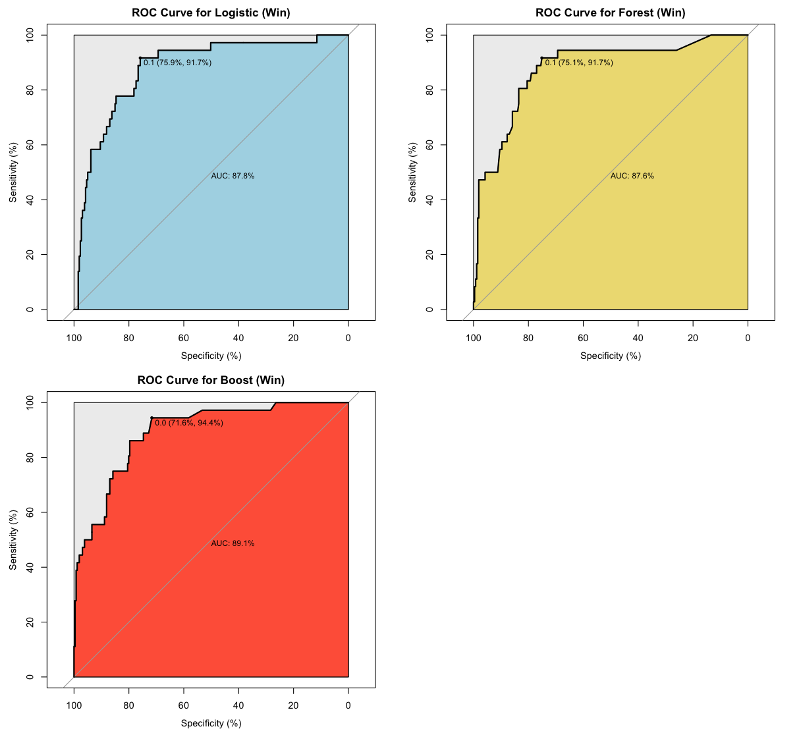
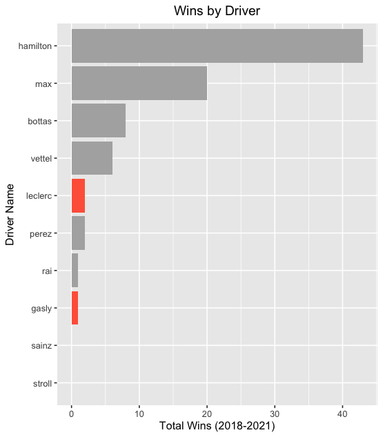
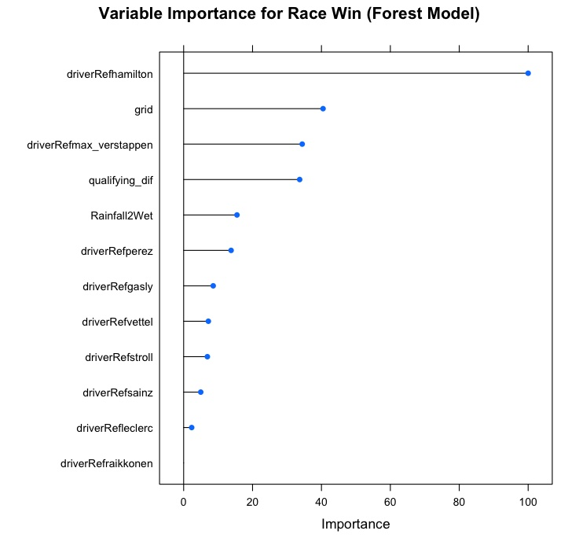
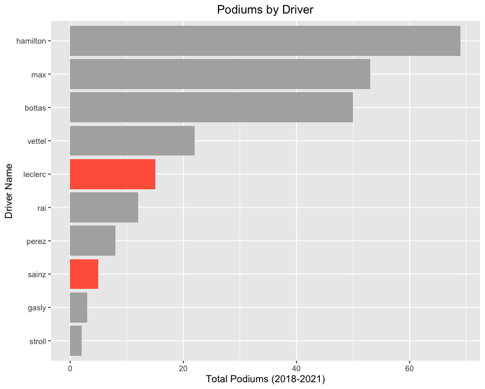
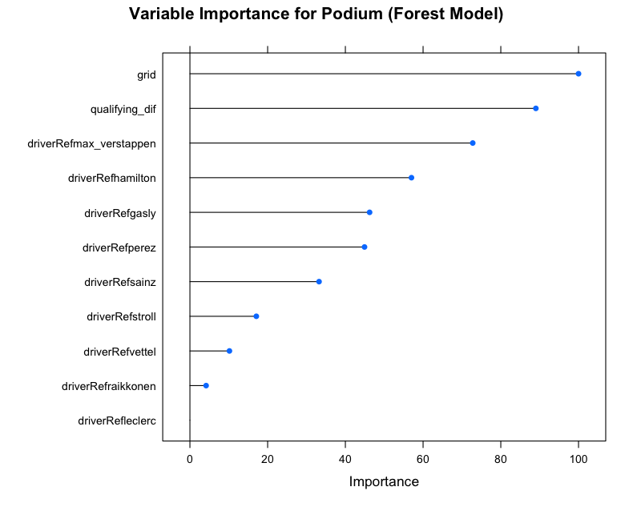

# Background

Formula 1 also known as F1 is a series of races (Grand Prix) that take place all across the world including countries from Europe, Asia, North America, and the Middle East. The sport has been around since the early 1950s and is considered as the premier league for open wheel racing. Points are awarded in each race to both the driver and the team that the driver belongs to. Each team is allowed two drivers with closely matched cars and currently (2022) there are 10 teams with 20 drivers in total. Each year two championships are awarded; one for the driver with the most points and the overall team (or constructor).

Historically, F1 has been classified into three main tiers: "Top Teams", "Midfield" (AKA Formula 1.5), and "Backmarkers". A large reason why these top teams remain on top is due to the much larger budgets that can be up to four times that of a smaller team. The bulk of these larger teams' budgets is spent in development and can be many years ahead of teams considered in the backmarker. The same can be said for drivers, where the top driver from Mercedes (Lewis Hamilton) makes approximately \$30 million and the best driver from the backmarker team Haas (Mich Schumacher) makes approximately \$1 million. However, in 2020 a budget cap was agreed upon and team budgets are maximized at \$145 million per year.

After Netflix released the Docuseries "Formula 1: Drive to Survive", in 2019, popularity of the sport has skyrocketed. Especially in the United States. Las Vegas has recently confirmed that they intend to build the United States third Grand Prix venue. As newcomers are introduced to the sport, one question ruminates...

Is it the car? Or the driver that matters?

Both students on this project are coming from separate viewing lenses. John Wyu is an avid fan of the sport and loves to analyze the different strategies between drivers & teams. Scotty Smith is a newbie, and has no idea what makes a driver worth \$30 million. "I do enjoy being proven wrong" - Scotty.

# Purpose

The purpose of this project can be broken into two different sections. First, we want to analyze & understand the difference between the aforementioned skill "Tiers." These are Top-Tier, Mid-Pack, and Back-Marker. In doing so we will illustrate the beauty behind the sport, and where the strategy comes to play.

Next, we want to dive deeper into the individuals & teams, and answer the looming question... Is Lewis Hamilton really worth \$30 million?

# The Data and Wrangling

The data used for this project was a mixture of a public dataset from Kaggle (<https://www.kaggle.com/datasets/rohanrao/formula-1-world-championship-1950-2020>) with further enrichment from a package FastF1 (<https://theoehrly.github.io/Fast-F1/>).

This data was broken down into multiple sheets with cross referenced ids and had data available for races from 1950 to 2020. The sheets are broken down into mainly two types of data: reference data and result data. Not all data was used to create the models and a summary of the data used is listed below. Additionally, enhancements to some of the data was used to further enrich additional variables for data modeling.

+--------------+------------------------------------------------------------------------------+--------------------------------------------------------------------------------------------------------------------------+
| Dataset Name | Description                                                                  | Additional Enhancements                                                                                                  |
+==============+==============================================================================+==========================================================================================================================+
| qualifying   | Summary of qualifying session for each race. Data included all session times | Track Temp, Air Temp, Wind Speed was added via python package FastF1                                                     |
+--------------+------------------------------------------------------------------------------+--------------------------------------------------------------------------------------------------------------------------+
| results      | Summary of race results per driver and team                                  | Air Temp, Track Temp, Wind Speed, Weather, Car Performance Metric, Fastest Lap was found per driver, Turns, Sharp Turns, |
+--------------+------------------------------------------------------------------------------+--------------------------------------------------------------------------------------------------------------------------+

## Data Selection

Formula 1 as a sport has changed drastically over the years and is broken down into separate eras of similar cars based on their technology. We would like to compare as similar of cars as possible so the era chosen was the most recent era coined the "Turbo-Hybrid" era which comes from the use of a hybrid engine along with turbos. This era began in 2014 and has only just ended in 2021 to make way for a new era in the sport. Furthermore, most contracts for drivers range between 1-5 years and many young drivers don't make it past 3-4 years in the sport.

With this in mind we decided to utilize data from 2018 to 2021 to build our model and make an applicable equivalency to a typical contract length and to keep similar drivers and teams.

#INSERT PARETO OF DRIVERS AND TEAMS

Based on the given dataset, there were 4 explanatory variables available to model our classification models. (grid, circuit, driver, fastest_speed) Our concern was the lack of variables given to us to produce models. A large effort was made to create additional variables such as Air.Temp, Track.Temp, Wind.Speed, Weather, Race.Circuit type (street or racing circuit), n_of_Sharp_Turns, car_performance (normalized against the fastest team per race), track_type based on speed, and turns per mile.

```{r , echo=FALSE}

```

To simply our split, we split the tracks above an average speed of 140 mph to be high speed tracks and everything below to be low speed tracks.

# Data Selection

In order to enrich our dataset, we used the ergast API through a package in Python called FastF1 to add additional environmental variables. Through the use of this package, we were able to add the variables, Track Temperature, Air Temperature, Wind Speed, Average Throttle Input (per driver), and Average Brake Input (per driver).

Formula 1 is broken down into separate eras of similar cars based on their technology. We would like to compare as similar cars as possible so the era chosen was the most recent era called the "Turbo-Hybrid" era which comes from the use of a hybrid engine along with turbos and stems from 2014 to 2020.

The dataset is broken up into qualifying.csv - this outlines all the times and laps set in

The inital dataset did not include weather and telemetry (e.g. full throttle, braking) data which was later enriched through our script in "Data_Enchancements.py".

## Data Preparation

# Purpose 1

To understand the differences between top, mid-tier, and backmarkers, we decided to run classification models for 3 different types of race results. In our first analysis, we looked at classification models to predict race wins.

### Race Wins:

To find the best classification model, we decided to run 3 different types of models: logistic regression, random forest, and XgBoost. With XgBoost, we tuned our model by looking at a variety of parameters (iterations, tree_depth, learn_rate, and gamma function). \##### MAYBE NEED TO INSERT ADDITIONAL CHARTS FOR PARAMETER TUNING

We used ROC curves based on test data to give us an overview with default parameters to find the optimal threshold for each model and looked at the overall accuracy, specificity, and sensitivity (with "Win" as the positive class) for all three models.

{width="7in"}

Overall, it appears that all models were comparable with the Boost model having a slightly higher AUC. For our analysis, we are primarily interested in the "Win" prediction and what factors are important to achieve this result. Therefore, setting the threshold to 0.1 for both Logistic and Forest models looked to give us the best overall score and highest specificity score and setting the threshold value to 0.05 appeared to be the best threshold for the boost model.

With the following thresholds, we then ran the models with a 60/40 split with cross validation of 5 folds and found the following accuracy, specificity, and sensitivity on the test data.

+-------------------------------------------+----------------+-------------------------+--------------------------+
| Model Type                                | Accuracy       | Sensitivity (Win Class) | Specificity (Lose Class) |
|                                           |                |                         |                          |
|                                           | (95% CI)       |                         |                          |
+===========================================+================+=========================+==========================+
| Logistic Regression (Threshold \> 0.1)    | 77.7%          | 91.6%                   | 75.8%                    |
|                                           |                |                         |                          |
|                                           | (72.6%, 82.3%) |                         |                          |
+-------------------------------------------+----------------+-------------------------+--------------------------+
| Random Forest (Threshold \>0.1)           | 79.5%          | 86.1%                   | 78.5%                    |
|                                           |                |                         |                          |
|                                           | (74.4%, 83.9%) |                         |                          |
+-------------------------------------------+----------------+-------------------------+--------------------------+
| Extreme Gradient Boost (Threshold \>0.05) | 75.1%          | 88.9%                   | 73.2%                    |
|                                           |                |                         |                          |
|                                           | (69.8%, 80.0%) |                         |                          |
+-------------------------------------------+----------------+-------------------------+--------------------------+

: Accuracy Scores for Classification Models (Race Wins)

Comparing across all 3 models, it appears that the Logistic Regression model performed the best when it came to fitting against the Win class and the Random Forest model gave slightly better predictions against the Lose class. All three accuracy scores are within the 95% confidence intervals between each other and therefore the model accuracy is similar. In the analysis below, we will use the Logistic Regression model to explain our race win data and the Random Forest Model to explain our lose data. While performing the analysis below, we will attempt to improve our model further through the use of stepAIC to limit siginificant variables in our logistic model and in the Random Forest we will leave only top importance variables.

#### Win Model:

Using the stepAIC function to tune our logistic model revealed that the two variables with the most amount of importance was "Grid" and "driverRef". The sensitivity score from this model was 88.9% and had a specificity score of 74.0%. A breakdown of the following coefficients are shown below:

| Variable                                              | Coefficients |
|-------------------------------------------------------|--------------|
| Grid - Order in which drivers line up before the race | -0.417       |
| Hamilton (Driver)                                     | 2.4107       |
| Max_Verstappen (Driver)                               | 1.5088       |
| Vettel (Driver)                                       | 0.5895       |
| Leclerc (Driver)                                      | 0.3154       |
| Raikkonen (Driver)                                    | -0.1053      |
| Perez (Driver)                                        | -0.4409      |
| Stroll (Driver)                                       | -15.0108     |
| Sainz (Driver)                                        | -16.0613     |
| Gasly (Driver)                                        | -16.1000     |
| Bottas(Driver)                                        | Reference    |

: Logistic Regression (driverRef, grid) Coefficients (Win-Class)

The reference driver used in this model was Bottas and a brief look at these coefficients shows that the top drivers (Hamilton and Verstappen) have an exceedingly high effect on the potential for a race win than compared with the reference driver. Both of these drivers stayed on the same team for all of the four years and were involved in the top team (Mercedes and Red Bull) with the most amount of wins. This model reflects that result heavily.

When looking at the top three drivers (Hamilton, Verstappen, and Vettel) seem to be able to outweigh the negative effect of a one or two bad grid units. Hamilton appears to erase almost 6 grid units and Max with 3 when compared with Bottas.

{width="5in"}

The more interesting points come from drivers such as Raikkonen, Vettel, Leclerc, and Perez (Mid-tier drivers). These drivers have switched teams and moved from top teams to middle/backmarker teams throughout their career. During this period, Leclerc specifically seems to stand out as he secured 2 wins in the 2019 season which is similar to Perez, but has a much larger positive influence on race wins probability. On the opposite spectrum, it appears that Gasly has a much lower influence than his surrounding drivers and significantly lower than Raikkonen, Perez, or Leclerc even though they've had similar number of wins.

A note of reference is that when drivers stay on the same team for all 4 years it is difficult to separate their performance and the performance of the car. One way to compare is to look at drivers and their teammates. The reference driver was Bottas which has also been on the Mercedes team for all 4 years, however when comparing his coefficient; it appears that Hamilton has a significant weight over his teammate when it comes to race wins.

#### Lose Model

To look at the variables that had the most effect on not winning, we chose to use the random forest model based on its relatively high specificity score. When we ran the Random Forest model against the test data, we got a specificity score of 78.6% which was similar to our score when only using the training data. The top variables that aligned with this model were Grid, Driver, Car Performance (qualifying_dif), and Rainfall. With this reduced model, we were able to bring up the specificity score up to 85.4% when running against the test data.

{width="5in"}

Our random forest paints a similar picture as it appears Hamilton, Verstappen, and Grid all have some of the highest influences on race wins. A few points are shown that was not seen in the logistic model. Firstly, the grid order seems to have a higher influence than Verstappen's influence and also Verstappen's importance is similar to how much car performance there is. Qualifying_dif is a variable that is calculated by finding the percentage difference between the qualifying times of a team (average of 2 drivers) and the fastest team. (e.g. If a team is slower by 8% per lap, their car performance is 92% the performance of the fastest team). Based on the random forest model, it appears that most environmental variables have more affect on a loss than the majority of drivers.

### Podium Finish (Top 3)

We ran the same analysis for podium finishes with the following model assessments with ROC curves to find the best thresholds and AUCs.

.jpeg){width="7in"}

+----------------------------------------+----------------+----------------------+--------------------------+
| Model Type                             | Accuracy       | Sensitivity (Podium) | Specificity (Not Podium) |
|                                        |                |                      |                          |
|                                        | (95% CI)       |                      |                          |
+========================================+================+======================+==========================+
| Logistic Regression (Threshold \> 0.4) | 80.8%          | 93.9%                | 74.2%                    |
|                                        |                |                      |                          |
|                                        | (75.9%, 85.1%) |                      |                          |
+----------------------------------------+----------------+----------------------+--------------------------+
| Random Forest (Threshold \> 0.4)       | 83.5%          | 87.9%                | 81.3%                    |
|                                        |                |                      |                          |
|                                        | (78.8%, 87.5%) |                      |                          |
+----------------------------------------+----------------+----------------------+--------------------------+
| Gradient Boost (Threshold \> 0.1)      | 76.7%          | 97.9%                | 66.6%                    |
|                                        |                |                      |                          |
|                                        | (71.5%,81.5%)  |                      |                          |
+----------------------------------------+----------------+----------------------+--------------------------+

Although the Boost model had the highest sensitivity parameter, the accuracy for that model is the weakest out of the 3 with a confidence interval that does not overlap either of the two models. Due to this difference, the two models that will be selected is the Logistic Regression to explain our Podium data and Random Forest to explain our out of podium data. Similar to the Win analysis, we will be using StepAIC and removing not important variables to try and get a higher sensitivity or specificity models.

#### Scoring Podiums

Once again, we used stepAIC to determine variables that were the most relevant for the logistic model as well as the simplest. The step function reduced the variables to grid, driver, Rainfall, car performance (qualifying_dif), and distance per turn. At optimal threshold, this model increased its accuracy to 83.5% and a sensitivity of 88.9%.

| Variable                         | Coefficient |
|----------------------------------|-------------|
| dist_s\_turns                    | 3.9167      |
| Verstappen (driver)              | 1.5079      |
| Hamilton (driver)                | 0.8722      |
| Vettel (driver)                  | -0.3813     |
| Raikkonen (driver)               | -0.5070     |
| Sainz (driver)                   | -0.8876     |
| Leclerc (driver)                 | -0.9698     |
| Gasly (driver)                   | -1.0414     |
| Stroll (driver)                  | -1.4145     |
| Perez (driver)                   | -1.4444     |
| Rainfall2Wet                     | -1.2820     |
| grid                             | -0.3583     |
| qualifying_dif (car performance) | -73.2314    |
| Bottas                           | Reference   |

: Coefficients of Logistic Model (Podium Finish)

Based on the reduced logistic model, it appears that the car performance has the biggest effect on the chances of getting a podium. There also appears to be some positive weights attached to circuits where the distance per turn is higher; indicating that potentially in higher speed circuits; our reference driver tends to prefer when it comes to achieving podiums.

In the race win model, the largest effects were caused by the two top drivers for the two top teams. There may be some relationship due to the top drivers usually driving the top cars. And there is no surprise that this is also consistent for achieving podiums. However, an interesting point is that in terms of a Hamilton vs Verstappen comparison; it appears that Verstappen may more weight in terms of achieving podiums.

Again, a surprising comparison of drivers is LeClerc and a Sainz which based on the logistic model are extremely similar in weight.

{width="5in"}

This is surprising because of the lack of amount of podiums from Sainz as compared to Leclerc yet while Leclerc was more favorable in terms of winning; in terms of podiums the model views these two drivers as almost equal.

An outcome from our top drivers (Bottas, Hamilton, and Max) shows a clear advantage of Max and Hamilton over Bottas. Although, Max and Bottas have similar counts of podiums, it would appear from the lm model that max has the better of our reference driver Bottas.

#### No Podium Finish:

In terms of specificity, our Random Forest seemed to show the highest specificity and is used to explain the negative class (No Podium). A brief look at the Random Forest Model found the following variables to have high importance: grid, qualifying_dif, and driverRef. Running the model and finding the ROC curve found a threshold of 0.4. The model's overall accuracy was 84.2% and a specificity of 82.8%.

{width="5in"}

The agreement across both models is that the car performance has a large effect on the winning a podium, whereas the Random Forest model lends a larger importance to grid than compared to the logistic model. When it comes to driver rankings, we are also seeing consistency for Verstappen having a higher influence than Hamilton. The lack of influence from LeClerc is interesting as well seeing that LeClerc scored 5th most podiums compared to the rest of our field.

### Running Above the Mid-Field (1-6)

Similarly, we looked at all three types of classification models and performed a ROC analysis to find the best thresholds and compare AUCs.

.jpeg){width="7in"}

+----------------------------------------+----------------+----------------------+--------------------------+
| Model Type                             | Accuracy       | Sensitivity (Podium) | Specificity (Not Podium) |
|                                        |                |                      |                          |
|                                        | (95% CI)       |                      |                          |
+========================================+================+======================+==========================+
| Logistic Regression (Threshold \> 0.5) | 82.5%          | 85.4%                | 79.0%                    |
|                                        |                |                      |                          |
|                                        | (77.7%, 86.6%) |                      |                          |
+----------------------------------------+----------------+----------------------+--------------------------+
| Random Forest (Threshold \> 0.6)       | 82.2%          | 82.3%                | 82.0%                    |
|                                        |                |                      |                          |
|                                        | (77.3%, 86.3%) |                      |                          |
+----------------------------------------+----------------+----------------------+--------------------------+
| Gradient Boost (Threshold \> 0.6)      | 82.5%          | 86.0%                | 78.2%                    |
|                                        |                |                      |                          |
|                                        | (77.7%, 86.6%) |                      |                          |
+----------------------------------------+----------------+----------------------+--------------------------+

Comparing the 3 models, the logistic regression had the highest AUC and all were above 90%. In terms of sensitivity, Gradient Boost gave the higher sensitivity with almost an equal drop in the specificity. The two models used to show Top6 and out of Top6 would be Gradient Boost and Random Forest. Similar to all analysis previously ran, we will be trying to tune our models to score even higher in either sensitivity or specificity while maintaining optimal accuracy.

#### Belonging to a Top Team (1-6):

In gradient boost, the top variables were grid, qualifying_dif, Track.Temp, and to a smaller degree drivers. We will use these top variables to build our model and fine tune the specific parameters surrounding XgBoost (rounds, max_depth, learning rate, and gamma loss). We found that with boosting iterations of 1600, the accuracy was the highest; however the first dip in accuracy occurs at a boost iteration of 300.

## \######## THIS PART WILL BE FOR ADDITIONAL ANALYSIS FOR MID-FIELD ANALYSIS

# CONCLUSION TO PURPOSE 1

# PURPOSE 2 ANALYSIS (Type below this line and I will type above it.

To analyze the variable importance and coefficients found within Teams, which have very similar cars, and for Individuals. What factors could be correlated to the cars performance, good or bad? What about individual Driver?

Is Lewis Hamilton really worth \$30 million?

## Method

For each ind/team a random forest model will be used to assess Variable Importance. Secondly, a Logistic Regression model will be used to analyze coefficients. The Logit Regression models show values that did not have low P-Values and futher steps with a StepAIC analysis would without doubt remove many of the variables presented in the below graphs. These are purposefully kept in, as our purpose with the Logit Regression model is to understand whether or not an explanatory variable has a negative or positive association. However, variables with a significant p-value will be more than insightful. The classification (Win, Top3, Top6) chosen for each individual/team had the highest specificity/sensitivity. Since these are independent models, we chose the classification that best represented each ind/team.

## TEAMS

+---------------+------------------------+-------------------+--------------------------+
| Team          | Years                  | Individuals       | Sample Size (Train,Test) |
+===============+========================+===================+==========================+
| Ferrari       | 2018,2019,2020, & 2021 | Leclerc & Vettel  | 113 (80% , 20%)          |
+---------------+------------------------+-------------------+--------------------------+
| Mercedes      | 2018,2019,2020, & 2021 | Bottas & Hamilton | 162 (70%, 30%)           |
+---------------+------------------------+-------------------+--------------------------+


### Insights (Teams):

The most notable insight between Ferrari and Mercedes is the Variable Importance of Driver Reference. On Mercedes the most valuable node is if the Driver is Lewis Hamilton or not. Secondly, we see that this is a positive coefficient from our Logit model with a high P-value represented by the \*\*\*. On the other hand, Driver Reference for Ferrari had the lowest Variable Importance and while did not show any significance in our Ferrari W/L Logit model coefficient graph, it did have a pvalue of .1082 with 97 degrees of freedom. What this indicates is that when the "car" is accounted for Lewis Hamilton is showing why he is paid the highest amount in the league.Driver Ref == "Hamilton" had less than a .005 pvalue with 113 degrees of freedom. No other variable had a significance level less than .12.

Another Insight considered, was the higher Variable Importance of environmental factors (Wind Speed, Track Temp, Weather) on the Ferrari team. As these environmental factors increase we see a negative correlation within our Ferrari Logit Coefficients. A deeper analysis shows that the Logit P-Values for Ferrari were (Wind Speed : .93, Track Temp: .53, & Rained : .99). In other words... there may be some value discovered by the Random Forest Variable Importance, but without more data these coefficients are unreliable.

------------------------------------------------------------------------

## INDIVIDUALS

| Individual     | Years                  | Team     | Sample Size  |
|----------------|------------------------|----------|--------------|
| Bottas         | 2018,2019,2020, & 2021 | Mercedes | 78 (83%,17%) |
| Max Verstappen | 2018,2019,2020, & 2021 | Red Bull | 69 (70%,30%) |
| Hamilton       | 2018,2019,2020, & 2021 | Mercedes | 84 (75%,25%) |


## {width="689"}

### Insights (Individuals):

One notable insight from our individual racer models is the Importance of Team Rank for Hamilton and lack there of for Bottas. Keep in mind these two racers have been on the same team for the last four years. With that said, it might be plausible that the Team Rank variable (How well the "car" qualified) would indicate similar Importance for the two. If the overall Qualifying rank for the team is lower, insinuating a better environmental fit for the Mercedes car, then both Bottas & Hamilton might see a positive correlation. However, this isn't true for Bottas. This could be a further indication of Lewis Hamilton's ability to overcome environmental factors and only have the machine and himself to account for any mistakes. Secondly, Grid has very rarely been outside of the #1 Variable Importance factor. In further examination of the Lewis Hamilton Logit model, the p-value for "Grid" is .59. After doing a StepAIC() analysis the only remaining coefficient is Team_Rank and Gris is removed. Lewis Hamilton is showing that even when he falls lower in the Grid ranking position there is no significance in his ability to secure the Win. For further validation on this, the only coefficient with a significant P-Value for Bottas is the Grid at a p-value of 0.034.

### Purpose 2 Conclusion:

Each driver and each team have different Variable Importance factors and correlation. It can be difficult to dive further into this with such small sample sizes, and we aren't following the best practices for either model. We used the two different models to piece together an understanding of the factors that effect drivers/teams. That being said we were able to make some considerable correlations that we can be confident in. Lewis Hamilton is showing the ability to be beyond environmental factors, and even the strongest factor for any other driver... the starting position. Where other teams have very little difference between drivers, indicating a potential strength of the car, Mercedes winning a race is highly correlated with that driver being Lewis Hamilton. Another interesting item to note, is that Bottas had 8 wins himself. The true difference is that Hamilton had 47 alone. I'll leave you with the final answer. Is Lewis Hamilton worth \$30 million?
