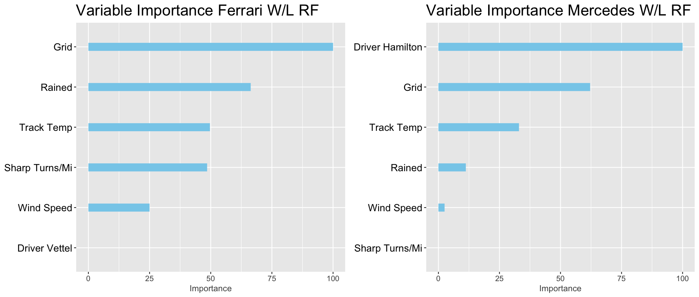
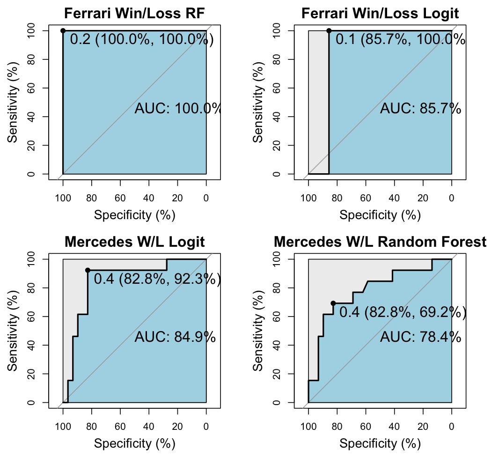
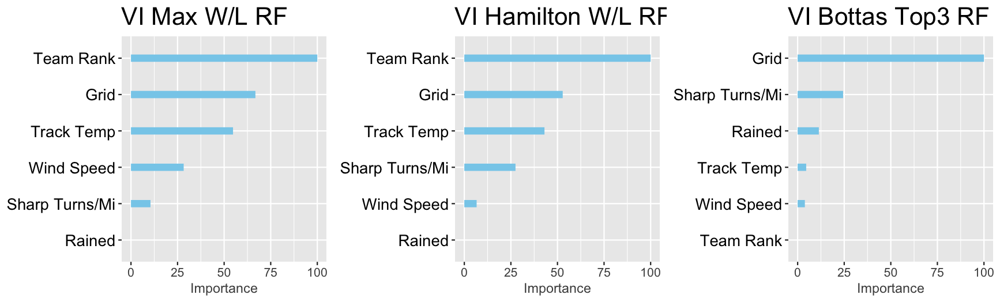
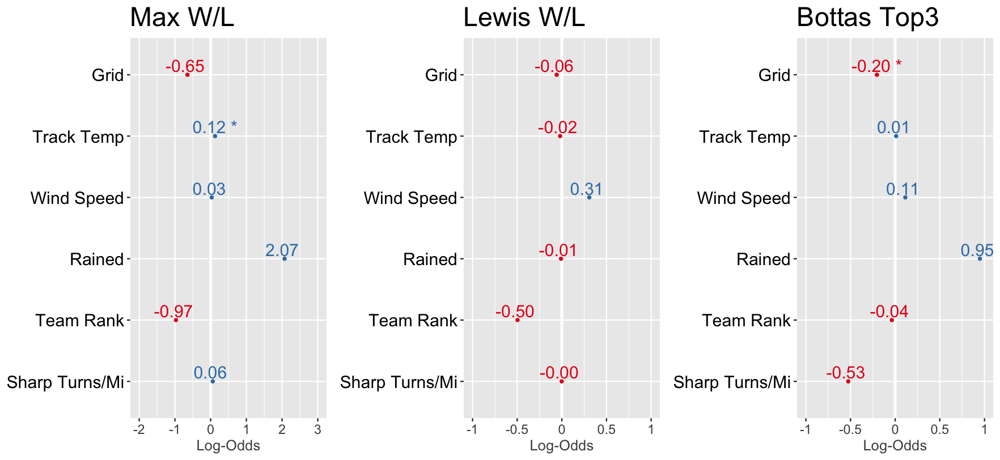
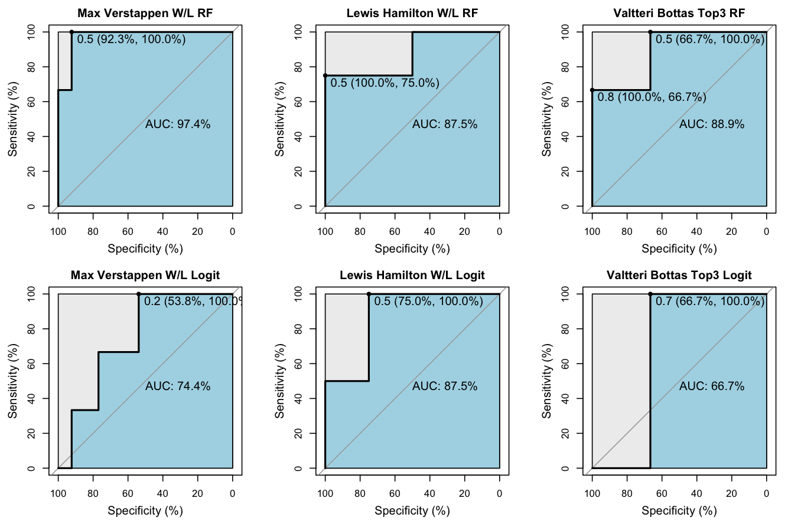

To analyze the variable importance and coefficients found within Teams, which have very similar cars, and for Individuals. What factors could be correlated to the cars performance, good or bad? What about individual Driver?

Is Lewis Hamilton really worth \$30 million?

## Method

For each ind/team a random forest model will be used to assess Variable Importance. Secondly, a Logistic Regression model will be used to analyze coefficients. The Logit Regression models show values that did not have low P-Values and futher steps with a StepAIC analysis would without doubt remove many of the variables presented in the below graphs. These are purposefully kept in, as our purpose with the Logit Regression model is to understand whether or not an explanatory variable has a negative or positive association. However, variables with a significant p-value will be more than insightful. The classification (Win, Top3, Top6) chosen for each individual/team had the highest specificity/sensitivity. Since these are independent models, we chose the classification that best represented each ind/team.

## TEAMS

| Team     | Years                  | Individuals       | Sample Size (Train,Test) |
|-----------------|-------------------|-----------------|--------------------|
| Ferrari  | 2018,2019,2020, & 2021 | Leclerc & Vettel  | 113 (80% , 20%)          |
| Mercedes | 2018,2019,2020, & 2021 | Bottas & Hamilton | 162 (70%, 30%)           |

### Insights (Teams):

The most notable insight between Ferrari and Mercedes is the Variable Importance of Driver Reference. On Mercedes the most valuable node is if the Driver is Lewis Hamilton or not. Secondly, we see that this is a positive coefficient from our Logit model with a high P-value represented by the. On the other hand, Driver Reference for Ferrari had the lowest Variable Importance and while did not show any significance in our Ferrari W/L Logit model coefficient graph, it did have a pvalue of .1082 with 97 degrees of freedom. What this indicates is that when the "car" is accounted for Lewis Hamilton is showing why he is paid the highest amount in the league.Driver Ref == "Hamilton" had less than a .005 pvalue with 113 degrees of freedom. No other variable had a significance level less than .12.

Another Insight considered, was the higher Variable Importance of environmental factors (Wind Speed, Track Temp, Weather) on the Ferrari team. As these environmental factors increase we see a negative correlation within our Ferrari Logit Coefficients. A deeper analysis shows that the Logit P-Values for Ferrari were (Wind Speed : .93, Track Temp: .53, & Rained : .99). In other words... there may be some value discovered by the Random Forest Variable Importance, but without more data these coefficients are unreliable.

## INDIVIDUALS

| Individual     | Years                  | Team     | Sample Size (Train,Test) |
|-----------------|-------------------|-----------------|--------------------|
| Bottas         | 2018,2019,2020, & 2021 | Mercedes | 78 (83% , 17%)           |
| Max Verstappen | 2018,2019,2020, & 2021 | Red Bull | 69 (70% , 30%)           |
| Hamilton       | 2018,2019,2020, & 2021 | Mercedes | 84 (75% , 25%)           |

{width="723" height="275"}

{width="1764" height="312"}

{width="711"}

### Insights (Individuals):

One notable insight from our individual racer models is the Importance of Team Rank for Hamilton and lack there of for Bottas. Keep in mind these two racers have been on the same team for the last four years. With that said, it might be plausible that the Team Rank variable (How well the "car" qualified) would indicate similar Importance for the two. If the overall Qualifying rank for the team is lower, insinuating a better environmental fit for the Mercedes car, then both Bottas & Hamilton might see a positive correlation. However, this isn't true for Bottas. This could be a further indication of Lewis Hamilton's ability to overcome environmental factors and only have the machine and himself to account for any mistakes. Secondly, Grid has very rarely been outside of the #1 Variable Importance factor. In further examination of the Lewis Hamilton Logit model, the p-value for "Grid" is .59. After doing a StepAIC() analysis the only remaining coefficient is Team_Rank and Gris is removed. Lewis Hamilton is showing that even when he falls lower in the Grid ranking position there is no significance in his ability to secure the Win. For further validation on this, the only coefficient with a significant P-Value for Bottas is the Grid at a p-value of 0.034.

### Purpose 2 Conclusion:

Each driver and each team have different Variable Importance factors and correlation. It can be difficult to dive further into this with such small sample sizes, and we aren't following the best practices for either model. We used the two different models to piece together an understanding of the factors that effect drivers/teams. That being said we were able to make some considerable correlations that we can be confident in. Lewis Hamilton is showing the ability to be beyond environmental factors, and even the strongest factor for any other driver... the starting position. Where other teams have very little difference between drivers, indicating a potential strength of the car, Mercedes winning a race is highly correlated with that driver being Lewis Hamilton. Another interesting item to note, is that Bottas had 8 wins himself. The true difference is that Hamilton had 47 alone. I'll leave you with the final answer. Is Lewis Hamilton worth \$30 million?
